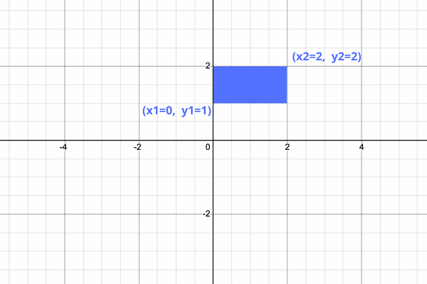
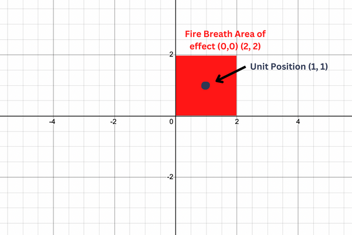

# DRAGONS
In "Age of Dragons", there are Orcs, Humans, Goblins, Dragons, etc. All of those different creatures are called "units". At the moment, the only thing specific to a unit is that it has a position on the game map and a name.

Dragons, a specific type of unit, can breathe fire in a large area dealing damage to any units that are touched by its fiery blaze.

## THE GAME GRID
Our game map is just a [Cartesian plane](https://en.wikipedia.org/wiki/Cartesian_coordinate_system).

## ASSIGNMENT
Complete the unit's `in_area` method and the dragon's `breathe_fire` method.

### IN_AREA
This method has four parameters, `x_1`, `y_1`, `x_2` and `y_2`. Where `x_1` and `y_1` make up the bottom-left point of the rectangle and `x_2` and `y_2` define the top-right point.

Use the unit's `pos_x` and `pos_y` to determine if it is inside of the rectangle, if so, return `True`. Otherwise, return `False`.

### BREATHE_FIRE
This method causes the dragon to breathe a swath of fire in the target area. The target area is centered at `(x,y)`. The area stretches for `__fire_range` in both directions *inclusively*.

For each unit in the `units` array, append that unit to a list if the unit is within the blast. `Return` the list of units hit by the blast.

EXAMPLE OF FIRE BREATH HITTING A UNIT

The example above uses a `__fire_range` of `1` centered on `(1, 1)`.