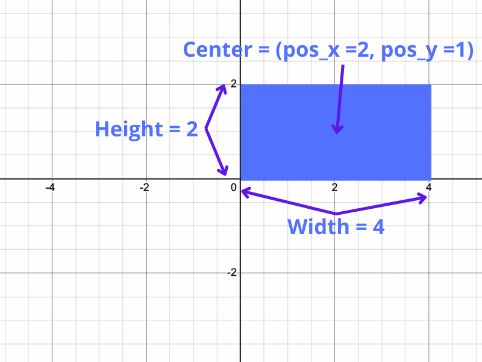

# BRINGING IT TOGETHER IN THE DRAGON CLASS
Let's bring all we've done together in the `Dragon` class. The `Dragon` class should override the Unit class's `in_area` method. Instead of checking if the center position of the Dragon is in the given area, we'll check if its big dragon body overlaps with the given area.

## ASSIGNMENT
First, complete the Dragon's constructor. The dragon needs one more private data member: `__hit_box`. The hitbox is a `Rectangle` object. You've been provided with the height, width, and center position (pos_x, pos_y) of the dragon.

## EXAMPLE HITBOX

## IN_AREA() METHOD()
Next, you'll need to override the `in_area` method. Create a new rectangle object with the given corner positions, and use the rectangle's `overlaps` method to check if the Dragon's `self.__hit_box` is inside it. This method should return a boolean value.